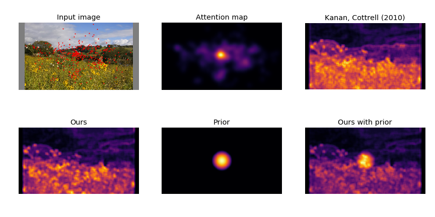

# Bayesian Saliency

This project aims to recreate the results of [Zhang et al 2008](http://jov.arvojournals.org/article.aspx?articleid=2297284#133855129)
by implementing a Bayesian framework to compute visual saliency
based on natural image statistics. Additionally, we include a prior over
the pixels to increase accuracy.

The image below shows an input image overlayed with the fixation maps
(red dots). Next to it you will find just the fixation map preprocessed
with a Gaussian kernel, which we will refer to as the ground-truth data.
The rest is a comparison between our method and a similar method.



## What is saliency

Saliency can be seen as a proxy for visual attention. The general theory
is that image features that are highly salient (popping out) are also
features are likely to be attended to. This is however a purely
bottom-up approach to attention and does not address the more difficult
problem of how to model top-down attention mechanisms.

## How does this method work?

In order to estimate the saliency of a pixel Zhang et al. have derived a
Bayesian framework for saliency. You can read more about this framework
in the linked paper. In short we do:

1. Calculate ICA filters from a set of natural images.
2. Compute responses by convolving filters with another set of images.
3. Fit a generalized Gaussian distribution to responses of each filter.
4. Compute saliency using parameters from the Gaussian.
5. Convolve saliency map with a normal distribution centered in the
   middle of the image (prior).

## How to use

The `main.py` file will compute the ICA components and the parameters of
the distributions. Make sure that `eizaburo-doi-kyoto_natim-c2015ff` is
located in the same directory along with `CAT2000_train`.

Then run the main file with the id of the file you want to estimate
saliency for. For example:

```
python main.py 11
```
